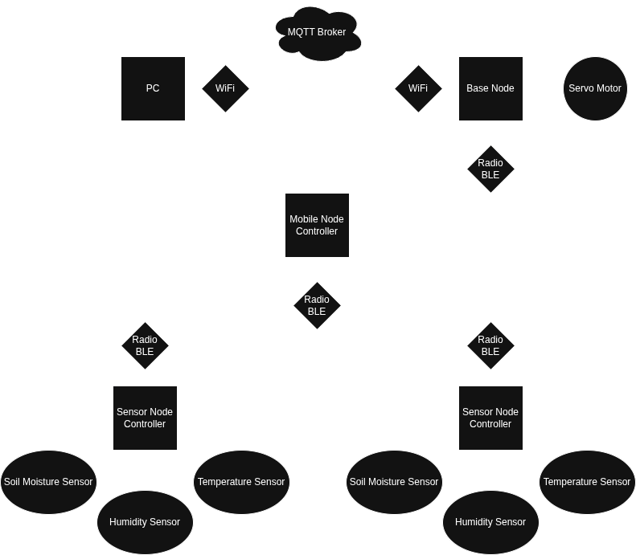
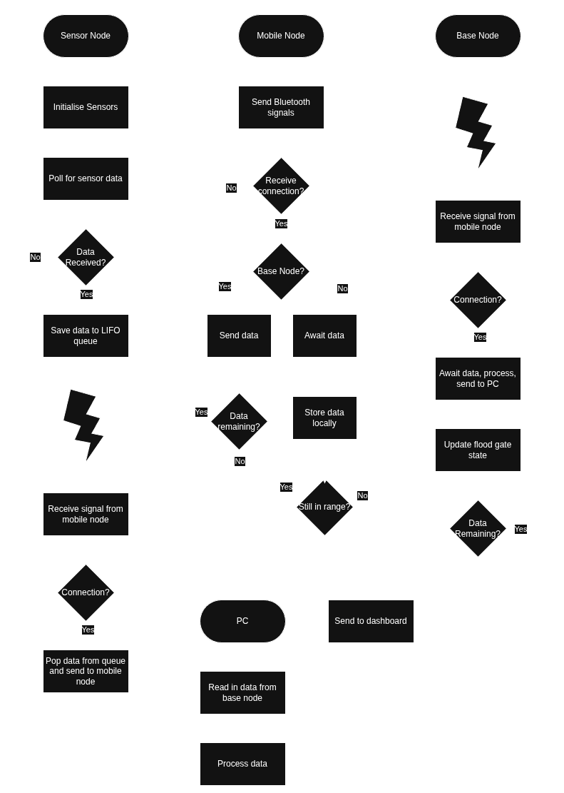

# Project Description

This project involves developing a distributed, Zephyr-based embedded system for intelligent dam control. The system consists of low-power static sensor nodes deployed across the surrounding environment, each measuring soil moisture, temperature, and humidity levels. A mobile 'mule' node fetches data opportunistically when within physical range of these sensor nodes, delivering it back to a central base node (situated at the dam site) when the mule returns from its circuit. Using this environmental data, the dam controller applies machine lerning and tuned control system aglorithms to dynamically determine the timing and extent by which to open a simulated floodgate (replicated via a Servo Motor and 3D Printed Mechanism), stabiising the surrounding area to maximise flooding during heavy rainfall and maximise hydration during droughts. 

## Block Diagram

To help in demonstrating the function of this system, the following block diagram images represent the broad function of the system. The first, hardware-oriented diagram is similar to the [Network Diagram](wireless_comms.md), showing the connections between sensors and controllers. The second, software-oriented diagram shows broadly the control flow expected of each node.

Hardware Block Diagram

Software Block Diagram

## DIKW Pyramid

The DIKW (Data-Information-Knowledge-Wisdom) Pyramid is a model used to display understanding. Consider the system in use in the context of an incoming storm. From the perspective of the system itself, the levels involved in such a case would be:
- ***Data:*** The raw values pulled from the sensors themselves. Alone, these figures mean nothing and require context.
- ***Information:*** The data will be timestamped, and stamped with node data to demonstrate where and when the data refers to.
- ***Knowledge:*** Combining these data points together once they've reached the base node allows for an understanding to be created of patterns and trends based on previously experienced data.
- ***Wisdom:*** With the above knowledge, trends and patterns can be extrapolated to start making predictions of future weather patterns.

Including people in the loop (eg via access to the dashboard), the levels of knowledge and wisdom would extend to include manual considerations.
